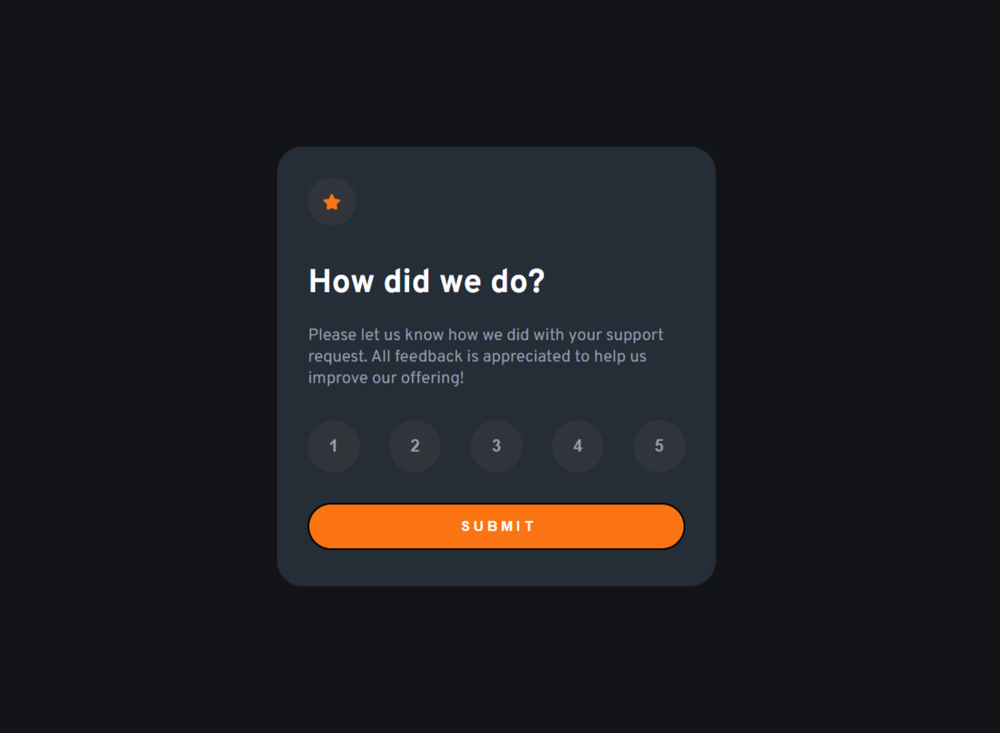

# Frontend Mentor - Interactive rating component solution

This is a solution to the [Interactive rating component challenge on Frontend Mentor](https://www.frontendmentor.io/challenges/interactive-rating-component-koxpeBUmI). Frontend Mentor challenges help you improve your coding skills by building realistic projects. 

## Table of contents

- [Overview](#overview)
  - [The challenge](#the-challenge)
  - [Screenshot](#screenshot)
  - [Links](#links)
- [My process](#my-process)
  - [Built with](#built-with)
  - [What I learned](#what-i-learned)
- [Author](#author)


## Overview

### The challenge

Users should be able to:

- View the optimal layout for the app depending on their device's screen size
- See hover states for all interactive elements on the page
- Select and submit a number rating
- See the "Thank you" card state after submitting a rating

### Screenshot



### Links

- Solution URL: [Add solution URL here](https://your-solution-url.com)
- Live Site URL: [Add live site URL here](https://your-live-site-url.com)

## My process

### Built with

- HTML5 
- CSS 
- Javascript
- Flexbox
- Media Queries

### What I learned

Learned about creating a flipping effect over the card when hovering over it or on any particular event(like clicking some submit button or any other event through javascipt).

Adding Code snippets of what I learned new or something which I am proud of: 

```html

  <div class="container">
    <div class="card">
      <div class="any-card front-card"> 
        <!-- Rating state start -->
        
        <h1 class="heading">How did we do?</h1>

        <p class="text">
          Please let us know how we did with your support request. All feedback is appreciated
          to help us improve our offering!
        </p>

        <div class="ratings-box">
          <button id="rating-btn1" class="rating-btn">1</button>
          <button id="rating-btn2" class="rating-btn">2</button>
          <button id="rating-btn3" class="rating-btn">3</button>
          <button id="rating-btn4" class="rating-btn">4</button>
          <button id="rating-btn5" class="rating-btn">5</button>
        </div>

        <button id="submit-btn">S U B M I T</button>

        <!-- Rating state end -->
      </div>
      <div class="any-card back-card">
        <!-- Thank you state start -->
        

        
        <p class="rating-value">You selected 999<!-- Add rating here --> out of 5</p>
        
        <h1 class="heading">Thank you!</h1>
        
        <p class="thankyou-text">We appreciate you taking the time to give a rating. If you ever need more support,
        don’t hesitate to get in touch!</p>
        
        <!-- Thank you state end -->
      </div>

    </div>  
  </div>  

```
```css
.card{ /* 'front-card' and 'back-card' lies inside this 'card' div */
    transform-style: preserve-3d; 
    /* If we don't use 'transform-style: preserve-3d;' then after flipping front-card, back-card won't appear.
    We need to 'preserve 3d' in order to achieve the back-card after flipping. 
    Otherwise we will just see the mirrored view of the front-card.
    */

    transition: all 0.5s ease;
}
.any-card{ /* applies for both, front-card and back-card */
    position: absolute;

    backface-visibility: hidden;
    /* Usually after flipping, the element gets mirrored. We don't wanna see the mirrored view of the element after flipping it.
    'backface-visibility: hidden;' helps us in achieving that.
    */
}

.back-card{ 
  transform: rotateY(180deg);
  /* So basically we want only front-card to appear first and back-card should kind of lay behind the front-card. 
  In order to achieve that we have rotated the back-card by 180 deg and set 'backface-visibility: hidden;' so that its mirrored-view doesn't appear.
  */
}
```
```js

/* Grabbing all the buttons */
const btn1 = document.getElementById('rating-btn1');
const btn2 = document.getElementById('rating-btn2');
const btn3 = document.getElementById('rating-btn3');
const btn4 = document.getElementById('rating-btn4');
const btn5 = document.getElementById('rating-btn5');

const submit_btn = document.getElementById('submit-btn');

function resetAllBtnColor(){
  btn1.style.color = Light_Grey;
  btn1.style.backgroundColor = "#31353b";
  // Similarly resetting all other n buttons styles.
}

btn1.addEventListener('click', function onClick() { // We can implement the same thing for every button.
  ratingSelected = 1;
  resetAllBtnColor();
  btn1.style.backgroundColor = Light_Grey;
  btn1.style.color = 'white';
});


submit_btn.addEventListener('click', function () {
  if(ratingSelected != 0){
    const rating_value = document.getElementsByClassName('rating-value')[0];
    rating_value.innerHTML = "You selected " + ratingSelected + " out of 5";
    const card_ele = document.getElementsByClassName('card')[0];
    card_ele.setAttribute("style","transform: rotateY(180deg);");
  }
});
```

## Author

- Frontend Mentor - [@adityaraj5200](https://www.frontendmentor.io/profile/adityaraj5200)
- Twitter - [@adityaraj5200](https://www.twitter.com/adityaraj5200)
